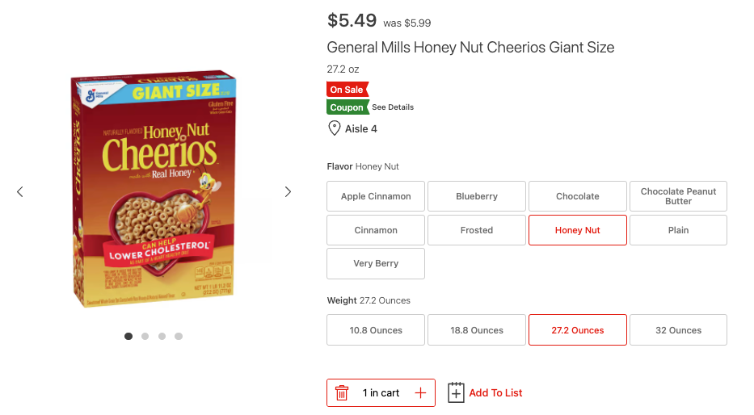

# QA_Screening

## Create a new file called "Answers.md" for your answers to these questions

Just complete to the best of your ability! Try not to overthink the latter sections and don't spend too long on it. If you don't know every answer, that's ok! Honest feedback is appreciated.

## SECTION 1 - APIs

### Go to [https://www.balldontlie.io/#introduction](https://www.balldontlie.io/#introduction) and read the documentation.

1. What is the `id` for Demar Derozan?
2. What is the `id` for the Dallas Mavericks?

### Go to [https://studio.apollographql.com/public/star-wars-swapi/home?variant=current](https://studio.apollographql.com/public/star-wars-swapi/home?variant=current) and read the documentation.

3. What is the `totalCount` of starships?
4. Copy and paste a film query that returns the film's director, releaseDate, and producers
5. What is the `height` that returns for Lando Calrissian?

## SECTION 2 - SQL

### Go to [https://data.stackexchange.com/stackoverflow/query/new](https://data.stackexchange.com/stackoverflow/query/new) for the following questions.

6. How many total users are the database with a displayName including "Randy"?
7. What is the Post Id of the highest score from any user whose location is "United Kingdom"?
8. How many comments did the user with the displayName "Enigmativity" leave in January 2022?

## SECTION 3 - QA Competency

### Scenario 1: We have an API endpoint that returns the 2nd largest number. Below are example request and response bodies. `https://api.hy-vee.com/numbers/second-largest`

Example Request Body:

```js
{
    numbers: [1,2,3,4,5]
}
```

Example Response Body:

```js
{
    number: 4
}
```

9. Write test cases for the endpoint

### Scenario 2: Observe the image below



10. Write test cases for the UI

11. Select a couple of the test cases from Scenario 1 or 2 and implement them in pseudo code. You can write in the language/framework of your choice, and save them in a separate file.